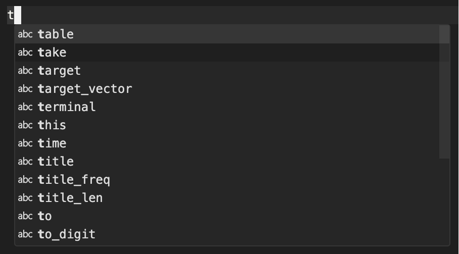

# Brief Introduction
---

<!-- column_layout: [2, 1] -->

<!-- column: 1 -->


<!-- column: 0 -->
* What is autocomplete?
* History of autocomplete
* Modern uses of autocomplete

<!-- end_slide -->

# Overview
---

Implement autocomplete:
* Naive approach
* Tries
* Radix Tries

Final results:
* Speed comparison

<!-- end_slide -->

# Getting started

Template Github repository for you to clone, available at `https://github.com/DPHSCodingClub/autocomplete_lab`

* Clone the repository
* Install node requirements
* Run server using `npm start`

<!-- end_slide -->

# Naive Approach

* Loop through every word
* Check if it starts with a prefix
* Add matches to final matches array
* O(n), where n is the size of the array

```javascript +line_numbers
let words = ["stop", "stone", "string", "example", "recursion", "stimulus"];

// searching for strings starting with "st"
let prefix = "st";
console.log(words.filter((w) => w.startsWith(prefix)));
```


<!-- end_slide -->

# Using Tries

* Powerful data structure
* Represents words as nodes
* Allows for fast text retrieval
* Allows for search speeds of O(m) where m is the size of a key


<!-- end_slide -->


A trie for keys "A", "to", "tea", "ted", "ten", "i", "in", and "inn". Each complete English word has an arbitrary integer value associated with it.

Note: This is actually a radix trie. Most people don't make a disctinction between a Radix Trie and a Trie, but they are different data structures.
